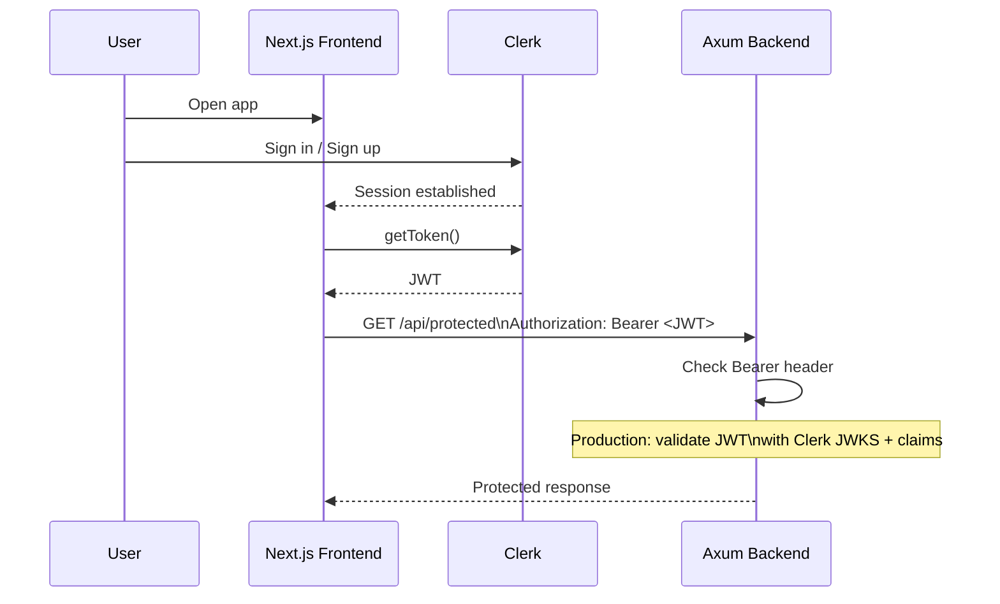

# next-clerk-rust-axum-auth-lab

Educational full-stack authentication lab that connects a **Next.js frontend with Clerk** to a **Rust backend using Axum**.

This repository is designed as both:
- a starter project for experimentation, and
- a research map for future AI/code agents.

## What this lab includes

- Next.js frontend (`/frontend`)
- Clerk authentication integration
- Sign in and sign up UI
- Frontend example showing how to obtain a Clerk JWT (`getToken()`)
- Frontend requests that send `Authorization: Bearer <token>` to backend
- Rust Axum backend (`/backend`)
- Public route (`GET /api/public`)
- Protected route (`GET /api/protected`) that checks Bearer token presence/format
- Inline backend comments showing where real Clerk JWT validation should happen
- `.env.example` files for frontend and backend
- `ai-knowledge-map/` folder for future AI agents

## Repository structure

```text
.
├── ai-knowledge-map/
├── backend/
└── frontend/
```

## Prerequisites

- Node.js 20+
- npm 10+
- Rust (stable)
- Cargo
- A Clerk application (for publishable/secret keys)

## Frontend setup (Next.js + Clerk)

1. Install dependencies:

   ```bash
   cd frontend
   npm install
   ```

2. Configure environment:

   ```bash
   cp .env.example .env.local
   ```

3. Fill in values in `.env.local`:

   - `NEXT_PUBLIC_CLERK_PUBLISHABLE_KEY`
   - `CLERK_SECRET_KEY`
   - `NEXT_PUBLIC_BACKEND_URL` (default `http://localhost:4000`)

4. Start frontend:

   ```bash
   npm run dev
   ```

Frontend runs on `http://localhost:3000`.

## Backend setup (Rust + Axum)

1. Install dependencies/build once:

   ```bash
   cd backend
   cargo build
   ```

2. Configure environment:

   ```bash
   cp .env.example .env
   ```

3. Start backend:

   ```bash
   cargo run
   ```

Backend runs on `http://localhost:4000` by default.

## API routes

### Public route

```http
GET /api/public
```

Expected response:

```json
{
  "message": "This is a public Axum route. No token required."
}
```

### Protected route

```http
GET /api/protected
Authorization: Bearer <clerk_jwt>
```

Behavior in this lab:
- Returns `401` when header is missing/invalid.
- Returns `200` when Bearer token format is present.
- Includes explicit code comments that production code must validate Clerk JWT signature/claims.

## Mermaid: authentication flow



## Validation commands

From repo root:

```bash
cd frontend && npm run lint && npm run build
cd ../backend && cargo test && cargo build
```

## AI knowledge map

See [`ai-knowledge-map/`](./ai-knowledge-map) for architecture, auth-flow, and security checklists tailored for future AI/code agents.
