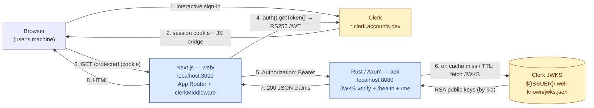
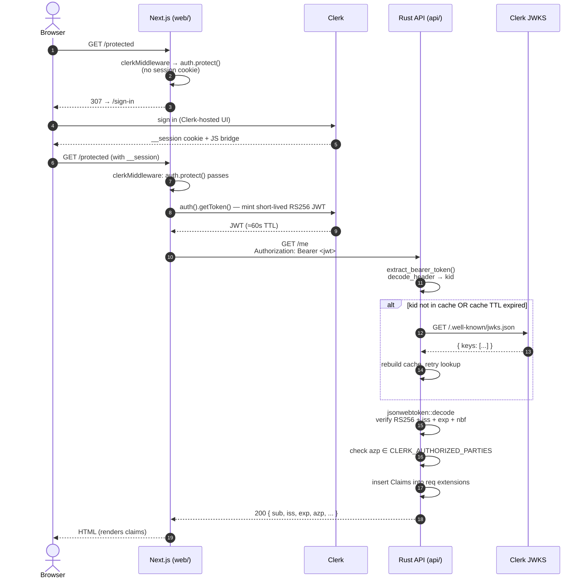
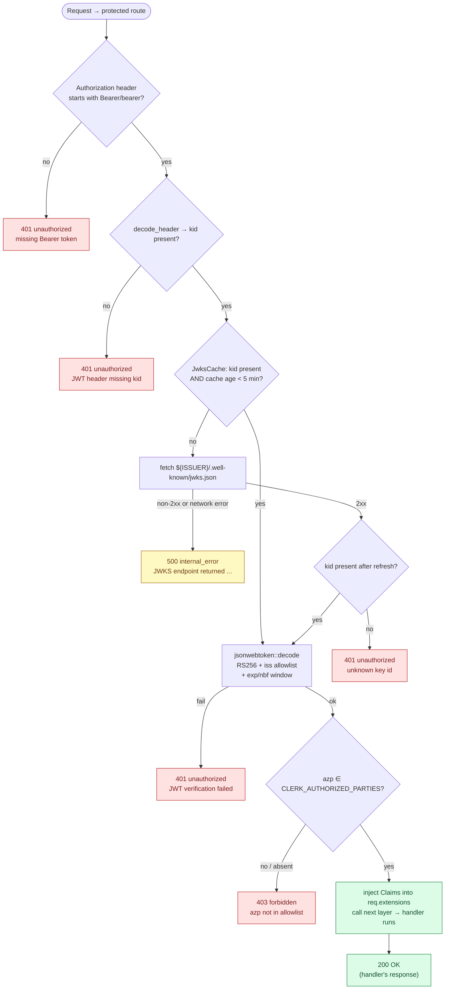
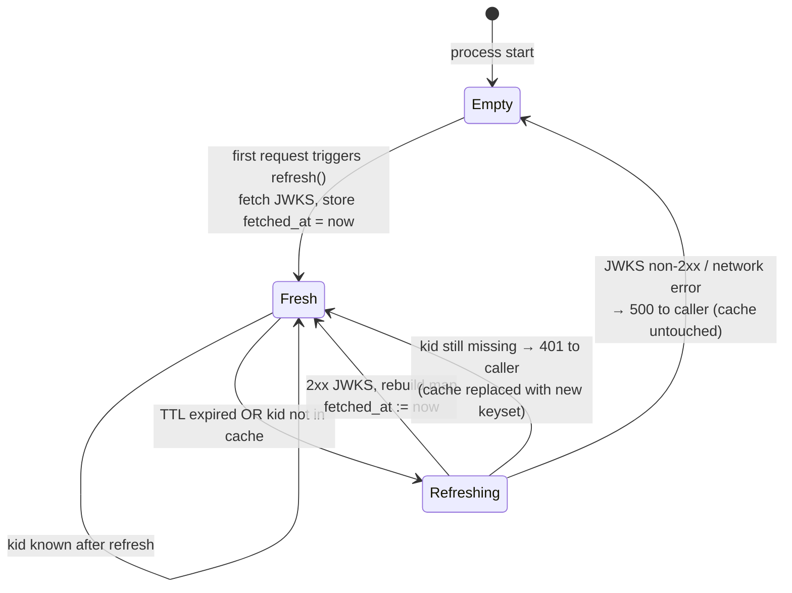
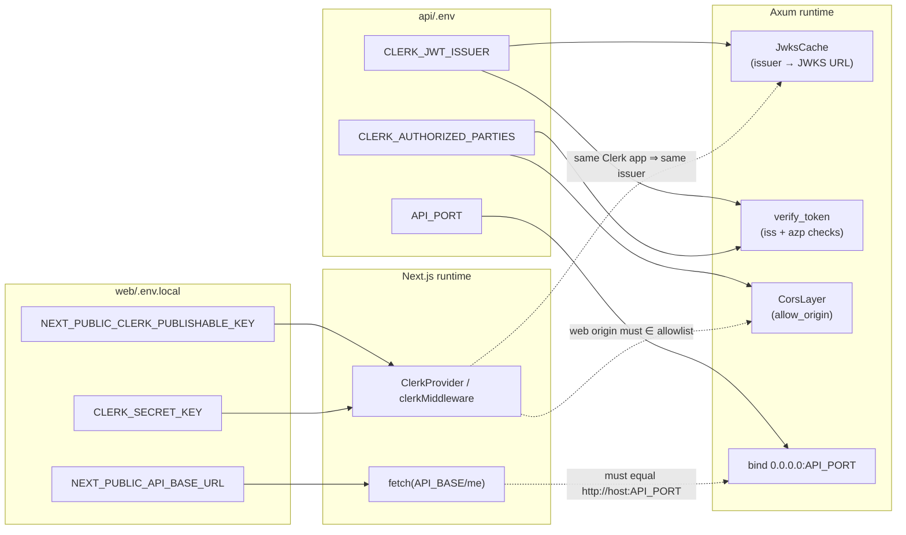
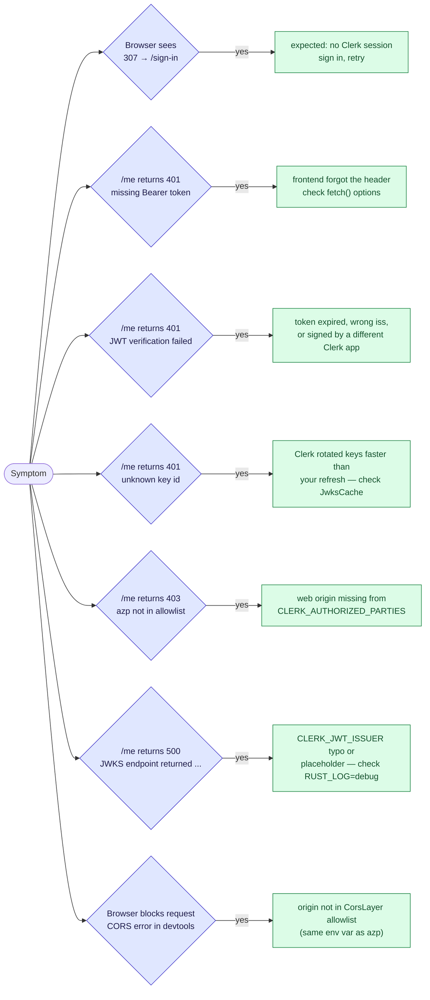

# Architecture Diagrams

Mermaid renderings of the lab's architecture and auth flow. GitHub, GitLab, VS Code, Obsidian, and most other modern Markdown viewers render these blocks inline — no external tooling needed.

Pair this with the prose docs:

- [`architecture.md`](./architecture.md) — decisions and out-of-scope.
- [`authentication-flow.md`](./authentication-flow.md) — narrative walkthrough with file/line references.
- [`backend-bearer-token.md`](./backend-bearer-token.md) — backend-only reference.
- [`ai-knowledge-map.md`](./ai-knowledge-map.md) — file tour and gotchas.

## 1. System context (component view)

Who talks to whom, and over what.

Yellow boxes are out-of-repo (Clerk-hosted). Blue boxes live in this monorepo.

## 2. End-to-end sequence (happy path)

The full sign-in → verified `/me` flow. Mirrors the ASCII sequence in [`authentication-flow.md`](./authentication-flow.md#sequence-happy-path) with the same step numbering.

## 3. Request verification — decision flow

What happens inside `require_auth` for a single request to a protected route. Each terminal node is a real status code the API returns.

Code references: `api/src/auth.rs:216-235` (`require_auth`), `api/src/auth.rs:171-208` (`verify_token`), `api/src/auth.rs:104-127` (`JwksCache::get_or_refresh`).

## 4. JWKS cache state machine

The cache has three observable states from a request's point of view. `JWKS_TTL` is 5 minutes (`auth.rs:81`).

> Note: a failed refresh does **not** poison the cache — the previously fresh keys remain usable until the next attempt. A `kid` miss after a successful refresh returns `401 unknown key id`, not 500.

## 5. Configuration topology

Which env var feeds which subsystem, and where the two sides must agree.

The dotted edges are the cross-app invariants. If any of them breaks, you get the failure modes documented in [`authentication-flow.md`](./authentication-flow.md#failure-modes-status-code-matrix).

## 6. Failure-mode map

Same matrix as the prose docs, rendered as a one-glance flow. Use this when triaging "auth not working".

## Editing tips

- Keep the prose docs as the source of truth for *why*; diagrams are for *shape*.
- When you change a behaviour (e.g. cache TTL, a new failure mode), update the relevant diagram **and** the prose. The repo has no automation that catches drift.
- Mermaid blocks render natively on GitHub. To preview locally, paste into <https://mermaid.live> or open the file in VS Code with the Markdown Preview Mermaid Support extension.

## Related issues

- [ZIZ-72](/ZIZ/issues/ZIZ-72) — this delivery (Mermaid architecture diagrams)
- [ZIZ-71](/ZIZ/issues/ZIZ-71) — end-to-end auth-flow doc (`authentication-flow.md`)
- [ZIZ-70](/ZIZ/issues/ZIZ-70) — backend bearer-token reference (`backend-bearer-token.md`)
